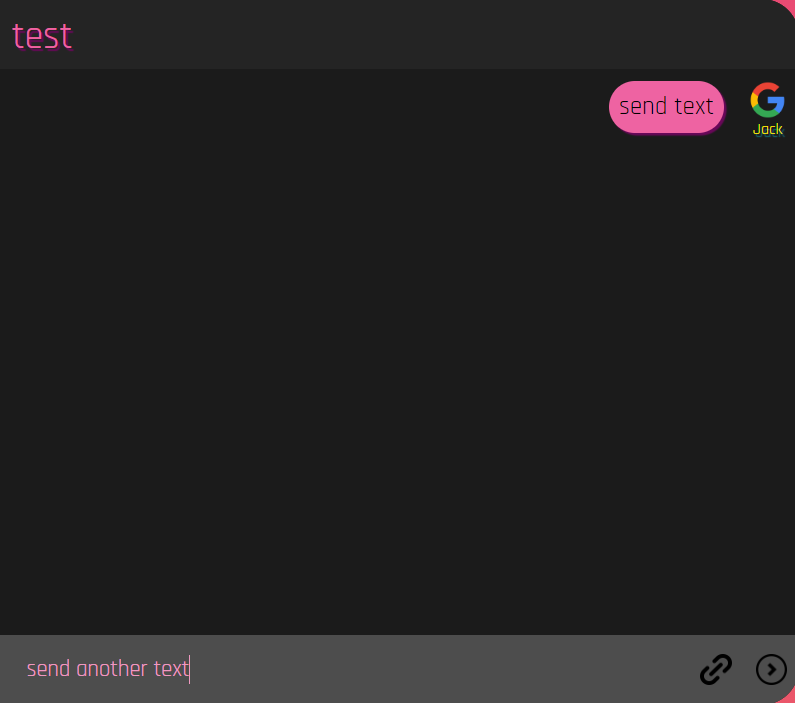

# Software Studio 2023 Spring Midterm Project

### Scoring

| **Basic components**                             | **Score** | **Check** |
| :----------------------------------------------- | :-------: | :-------: |
| Membership Mechanism                             | 15%       | Y         |
| Firebase page                                    | 5%        | Y         |
| Database read/write                              | 15%       | Y         |
| RWD                                              | 15%       | Y         |
| Chatroom                                         | 20%       | Y         |

| **Advanced tools**                               | **Score** | **Check** |
| :----------------------------------------------- | :-------: | :-------: |
| Using React                                      | 10%       | Y         |
| Third-Party Sign In                              | 1%        | Y         |
| Notification                                     | 5%        | Y         |
| CSS Animation                                    | 2%        | Y         |
| Security                                         | 2%        | Y         |

| **Other useful functions**                         | **Score** | **Check** |
| :----------------------------------------------- | :-------: | :-------: |
| Name of functions                                  | 1~5%     | N         |

---

### How to use 

    Describe how to use your web and maybe insert images or gifs to help you explain.

### You can registe or log in this app

### Function description

    Describe your bonus function and how to use it.
    
### Use the searchbar at the top-right to search for another user, and you can add user into the current choose group by click them!

### You can choose the chatroom at this area and click the button to log out and add group!

### text some message and send them to your chatroom! You can also send a picture with your message

### Click the message that you send to unsend it!!!

### Firebase page link

[Visit Zack's chatroom!](zack-s-chatroom.web.app)

### Others (Optional)

    Anything you want to say to TAs.

